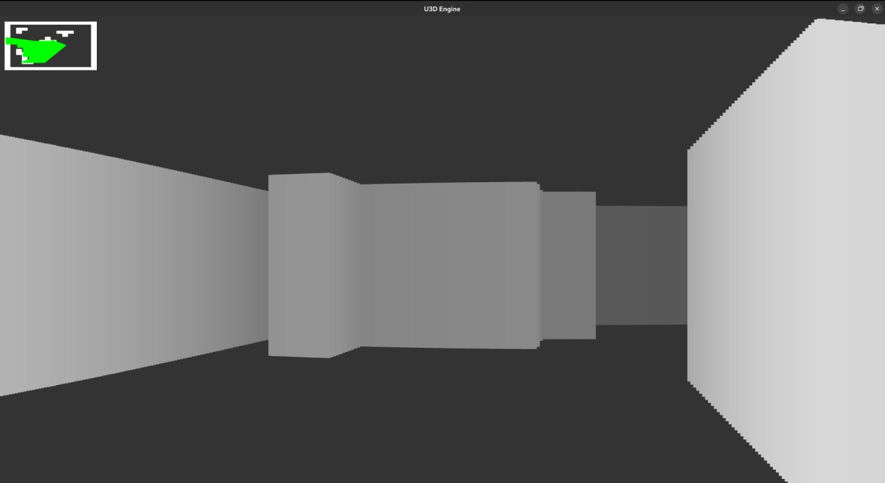

# 3D Engine

The idea was to render 3d with ray casting. It is written in rust.

## Screenshot:

## How to run

Requirements: **rust + cargo**

`cargo run --release`

## Dependencies

- [Piston](https://crates.io/crates/piston)
